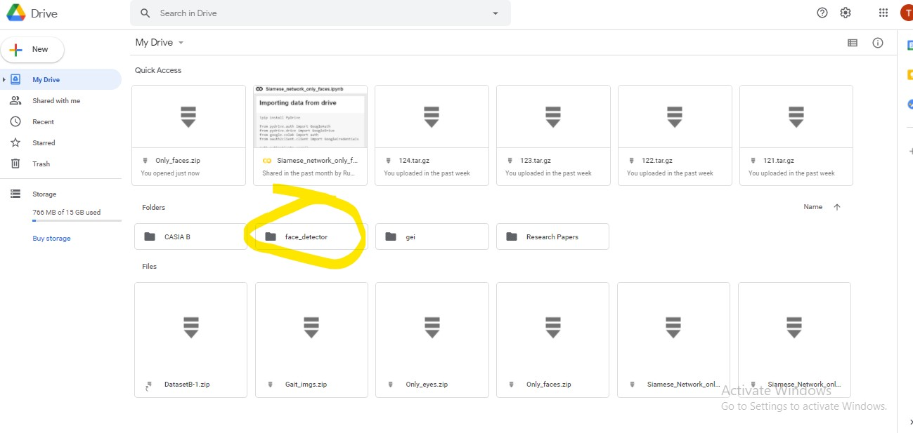
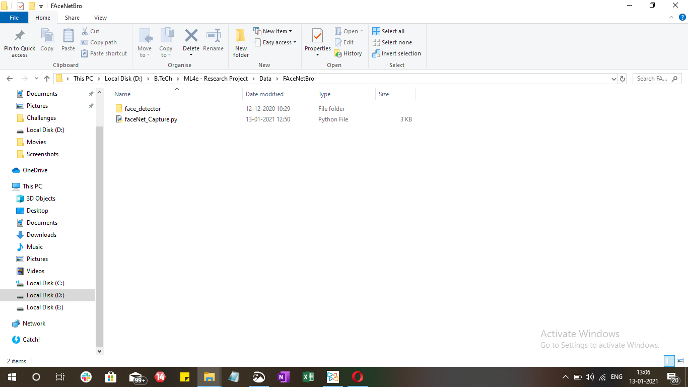
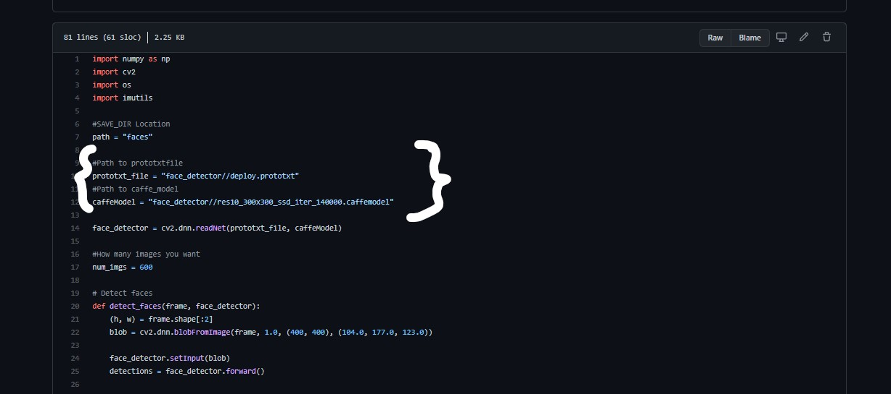

# Face-Recognition

<h2>Instructions for making face Dataset</h2>
<ol>
  <li>Train Unmasked : 400</li>
  <li>Val Unmasked : 200</li>
  <li>Masked : 100</li>
</ol>
<table>
  <tr>
    <td>First download this folder from drive</td>
  </tr>
  <tr>
    <td></td>
  </tr>
    <tr>
    <td>Save the folder in the same directory where you are running the script file</td>
  </tr>
  <tr>
    <td></td>
  </tr>
    <tr>
    <td>Run the script file(i.e. faceNet_Capture.py) and keep changing your expressions w/o showing your teeth😉</td>
  </tr>
  <tr>
    <td></td>
  </tr>

 </table>
